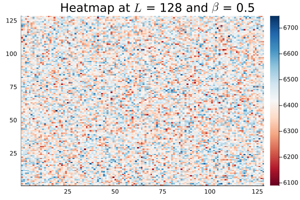
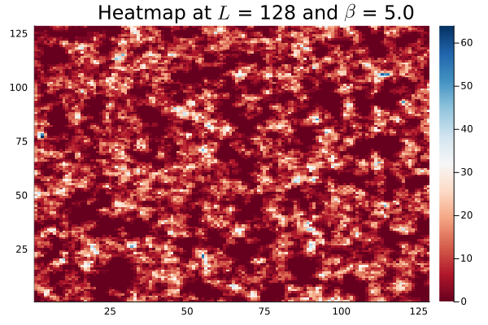

# Glass-transition
Study of the glass transition in the Fredrickson-Anderson (FA) model.

We analyze the relaxation time of the autocorrelation functions and study its dependence with the inverse temperature, showing the presence of two regions: an Arrhenius glass for high temperatures and a super-Arrhenius glass for low temperatures.
We then present the mobility map, that is an heatmap that counts how many times a spin of the lattice has flipped: this shows that in the super-Arrhenius phase there are clusters of spins, associated with high mobility regions.

## To do

Implement a jax version of this metropolis algorithm to test performances.
